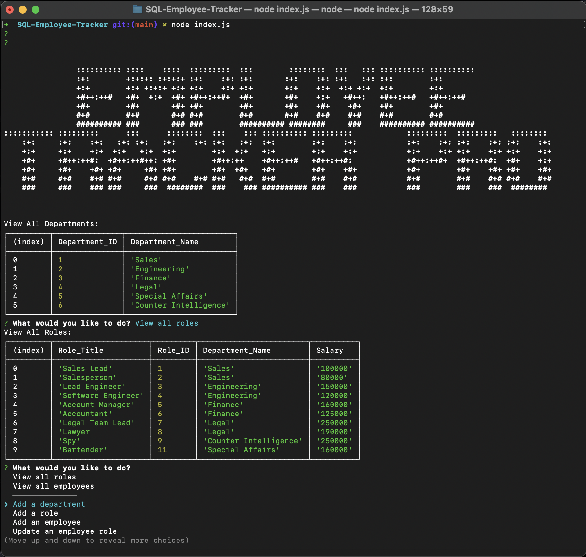

# SQL-Employee-Tracker 
This is a command line content management system that uses Node.js, Inquirer, and MySQL.

## Description:
Employee Tracker Pro uses node and SQL to allow you to add details about the employees and their roles in your company. You can see tables of the current departments, roles, and employees. You can also use the app to add new departments, roles, and employees, or update the details about your employess. 

This is a exercise in using SQL with node.js and mySQL2.  

## Table of Contents:
  - [Installation](#installation)
  - [Usage](#usage)
  - [Demonstration](#demonstration)
  - [License](#license)

## Installation:
This application requires using inquirer and mySQL2, use "npm i" to install the required dependencies. You can also seed the database to begin with our seeds.sql files using mySQL. 

## Usage:
Invoke the file with "node index.js". It will then prompt you with the options for viewing and editing the data.  

## Demonstration:
[Here is a video demonstration of my application](https://drive.google.com/file/d/1XsMCYRmnw50NkaLL_iGuNyXui3OJgWNM/view)

## License:
-[MIT](https://opensource.org/license/mit/) 

### Enjoy!
